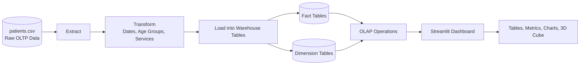
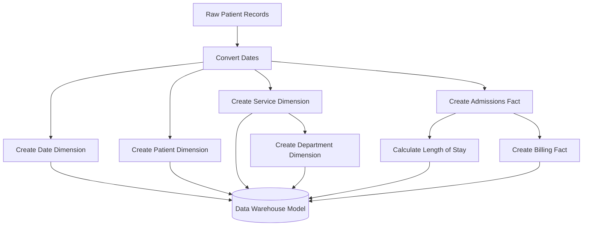
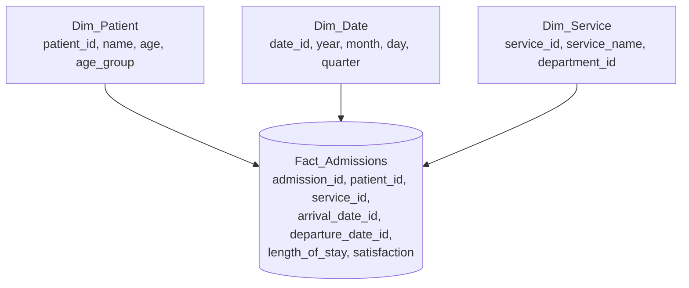
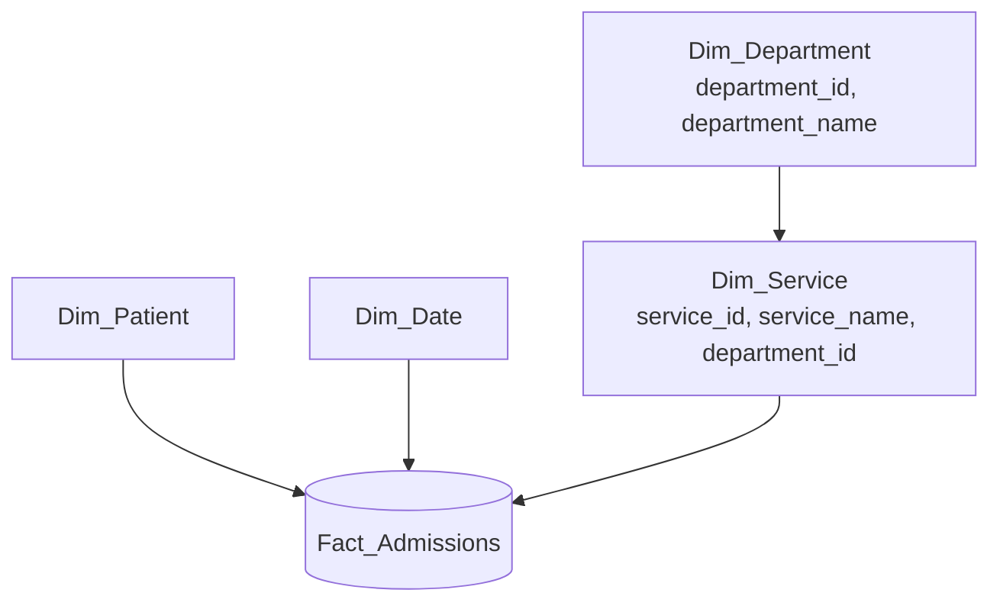
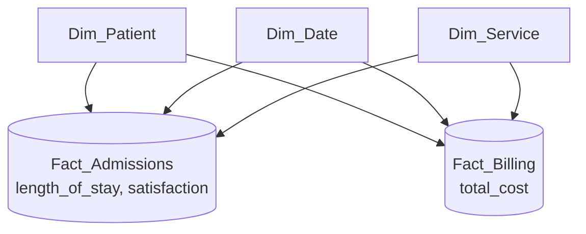
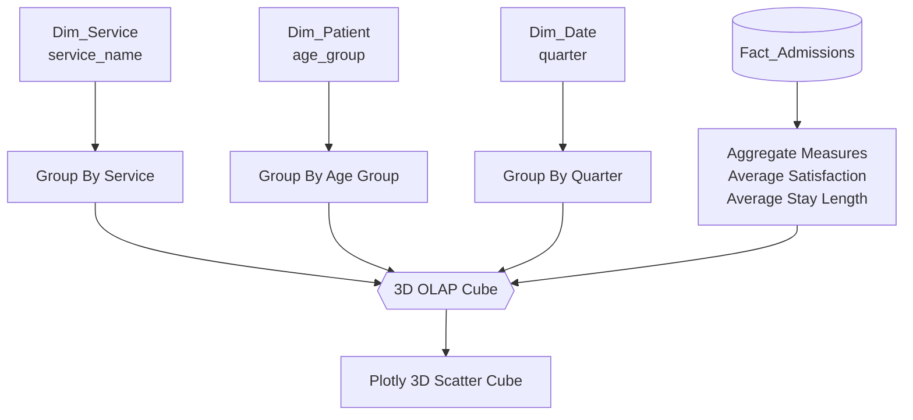
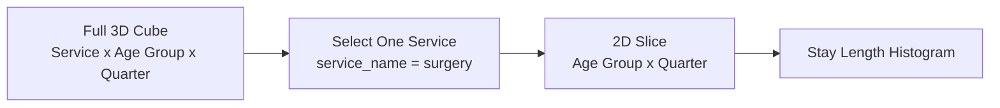
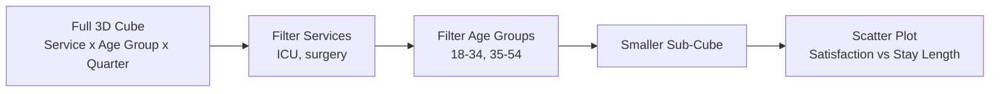
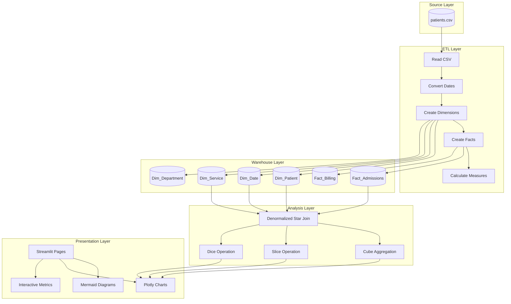

# Data Warehouse Pro Dashboard Documentation

## 1. Project Overview

Data Warehouse Pro Dashboard is a Streamlit-based analytical dashboard built on synthetic patient admission data. The project demonstrates how raw operational data can be transformed into a data warehouse model and then explored using OLAP operations such as cube aggregation, slicing, and dicing.

The application uses `patients.csv` as the raw source dataset. The data is processed in `data_models.py`, rendered through `app.py`, and visualized through `visualizations.py`.

### Main Objective

The goal of this project is to demonstrate core data warehousing and analytical data mining concepts using hospital patient flow data.

The project covers:

- ETL processing
- Dimensional modeling
- Star schema
- Snowflake schema
- Fact constellation schema
- OLAP cube generation
- Aggregation
- Slicing
- Dicing
- Analytical visualization

> Note: This project focuses on descriptive analytics and OLAP-based data mining. It does not implement predictive machine learning models such as classification, regression, or clustering.

---

## 2. Technology Stack

| Component | Technology Used | Purpose |
|---|---|---|
| Programming language | Python | Core application logic |
| Web dashboard | Streamlit | Interactive user interface |
| Data processing | Pandas | Reading, transforming, and aggregating data |
| Numerical support | NumPy | Synthetic billing value generation |
| Visualization | Plotly | Interactive charts and 3D cube plotting |
| Diagram rendering | Mermaid through Streamlit components | Flowcharts and schema diagrams |
| Dataset | `patients.csv` | Raw patient admission records |

---

## 3. Project File Structure

```text
datawarehouse proj/
|
|-- app.py
|   Main Streamlit application. It controls navigation, page layout,
|   dashboard sections, and user interaction.
|
|-- data_models.py
|   Performs ETL processing and creates fact/dimension tables.
|
|-- visualizations.py
|   Contains Mermaid diagrams and Plotly visualizations.
|
|-- patients.csv
|   Raw operational dataset containing patient admission records.
|
|-- requirements.txt
|   Python dependencies required to run the project.
```

---

## 4. Source Dataset

The source dataset is `patients.csv`. It contains 1,000 patient admission records.

### Raw Columns

| Column | Description |
|---|---|
| `patient_id` | Unique identifier for each patient |
| `name` | Patient name |
| `age` | Patient age |
| `arrival_date` | Admission or arrival date |
| `departure_date` | Discharge or departure date |
| `service` | Hospital service used by the patient |
| `satisfaction` | Patient satisfaction score |

### Service Categories

The dataset contains the following service values:

- `emergency`
- `general_medicine`
- `ICU`
- `surgery`

---

## 5. High-Level System Flow

The project follows a classic data warehousing pipeline:

1. Read raw patient records from CSV.
2. Clean and transform date/service/patient attributes.
3. Create dimension tables.
4. Create fact tables.
5. Join fact and dimension data for analysis.
6. Apply OLAP operations.
7. Display charts and tables in Streamlit.



---

## 6. ETL Process

ETL means Extract, Transform, and Load. It is the foundation of the project.

### 6.1 Extract

The application reads the raw CSV file using Pandas:

```python
df = pd.read_csv(csv_path)
```

The raw CSV acts like an OLTP-style operational table. It stores event-level patient admission data.

### 6.2 Transform

The transformation phase prepares raw records for analytical use.

Transformations performed:

- Convert `arrival_date` and `departure_date` into datetime format.
- Generate a date dimension from all arrival and departure dates.
- Derive `year`, `month`, `day`, and `quarter`.
- Create patient age groups.
- Map services to departments.
- Generate surrogate keys such as `service_id`, `department_id`, and `admission_id`.
- Calculate `length_of_stay`.
- Generate a synthetic billing fact table.

### 6.3 Load

The transformed data is loaded into in-memory warehouse-style tables:

- `Dim_Patient`
- `Dim_Date`
- `Dim_Service`
- `Dim_Department`
- `Fact_Admissions`
- `Fact_Billing`

These tables are returned as a Python dictionary from `load_and_process_data()`.



---

## 7. Data Warehousing Concepts Used

### 7.1 OLTP vs OLAP

The original CSV behaves like OLTP data because each row represents an individual transaction-like event: one patient admission.

The transformed tables behave like OLAP data because they are structured for analysis, aggregation, filtering, and reporting.

| Concept | OLTP | OLAP |
|---|---|---|
| Main use | Daily operations | Analysis and reporting |
| Data shape | Transaction records | Fact and dimension tables |
| Query type | Insert/update/read single records | Aggregate many records |
| Example in project | `patients.csv` row | Average satisfaction by service, age group, and quarter |

### 7.2 Fact Table

A fact table stores measurable business events. In this project, admissions and billing are facts.

Fact tables contain:

- Foreign keys to dimensions
- Numeric measures
- Event identifiers

### 7.3 Dimension Table

A dimension table stores descriptive context for facts.

Dimensions answer questions like:

- Who? Patient
- When? Date
- What service? Service
- Which department? Department

### 7.4 Measure

A measure is a numeric value used for analysis.

Measures used in the project:

- `length_of_stay`
- `satisfaction`
- `total_cost`

### 7.5 Grain

Grain defines the level of detail stored in a fact table.

The grain of `Fact_Admissions` is:

> One row per patient admission.

The grain of `Fact_Billing` is:

> One billing record generated from one admission record.

Understanding grain is important because all aggregations depend on it.

---

## 8. Dimension Tables

### 8.1 `Dim_Patient`

Stores patient-level descriptive data.

| Column | Description |
|---|---|
| `patient_id` | Patient key |
| `name` | Patient name |
| `age` | Patient age |
| `age_group` | Derived age category |

Age groups are generated as:

| Condition | Age Group |
|---|---|
| Age below 18 | `<18` |
| Age 18 to 34 | `18-34` |
| Age 35 to 54 | `35-54` |
| Age 55 or above | `55+` |

### 8.2 `Dim_Date`

Stores calendar attributes for arrival and departure dates.

| Column | Description |
|---|---|
| `date` | Actual date |
| `date_id` | Integer date key in `YYYYMMDD` format |
| `year` | Year |
| `month` | Month number |
| `day` | Day number |
| `quarter` | Calendar quarter |

### 8.3 `Dim_Service`

Stores hospital service details.

| Column | Description |
|---|---|
| `service_id` | Service key |
| `service_name` | Service name |
| `department_id` | Foreign key to department |

### 8.4 `Dim_Department`

Stores normalized department information.

| Column | Description |
|---|---|
| `department_id` | Department key |
| `department_name` | Department name |

Service-to-department mapping:

| Service | Department |
|---|---|
| `ICU` | Critical Care |
| `emergency` | Critical Care |
| `surgery` | Surgical |
| `general_medicine` | General Medicine |

---

## 9. Fact Tables

### 9.1 `Fact_Admissions`

This is the main fact table used for patient admission analysis.

| Column | Description |
|---|---|
| `admission_id` | Admission event identifier |
| `patient_id` | Foreign key to `Dim_Patient` |
| `service_id` | Foreign key to `Dim_Service` |
| `arrival_date_id` | Foreign key to `Dim_Date` |
| `departure_date_id` | Foreign key to `Dim_Date` |
| `length_of_stay` | Number of days between arrival and departure |
| `satisfaction` | Patient satisfaction score |

### 9.2 `Fact_Billing`

This secondary fact table demonstrates fact constellation modeling.

| Column | Description |
|---|---|
| `billing_id` | Billing event identifier |
| `patient_id` | Foreign key to `Dim_Patient` |
| `service_id` | Foreign key to `Dim_Service` |
| `date_id` | Billing date key |
| `total_cost` | Synthetic billing amount |

The `total_cost` value is generated using random base costs and service-based multipliers.

---

## 10. Schema Designs

## 10.1 Star Schema

A star schema contains one central fact table directly connected to denormalized dimension tables.

In this project:

- Central fact: `Fact_Admissions`
- Dimensions: `Dim_Patient`, `Dim_Date`, `Dim_Service`



### Why Star Schema Is Useful

- Simple to understand
- Fast for analytical queries
- Easy to aggregate facts by dimensions
- Commonly used in dashboards and reports

---

## 10.2 Snowflake Schema

A snowflake schema normalizes one or more dimensions into additional related tables.

In this project, `Dim_Service` is normalized through `Dim_Department`.



### Why Snowflake Schema Is Useful

- Reduces repeated dimension values
- Improves consistency
- Represents hierarchy clearly
- Useful when dimensions have multiple levels

Example hierarchy:

```text
Department -> Service -> Admission
```

---

## 10.3 Fact Constellation Schema

A fact constellation schema, also called a galaxy schema, contains multiple fact tables sharing common dimensions.

In this project:

- `Fact_Admissions` stores admission metrics.
- `Fact_Billing` stores billing metrics.
- Both share patient, date, and service dimensions.



### Why Fact Constellation Is Useful

- Supports multiple business processes
- Allows shared dimensions across different facts
- Enables cross-domain analysis
- Represents enterprise-level warehouse design

Example:

> Compare patient satisfaction from admissions with billing cost by service.

---

## 11. OLAP Concepts Used

OLAP stands for Online Analytical Processing. It allows users to analyze data from multiple dimensions.

This project demonstrates three OLAP operations:

- Cube
- Slice
- Dice

---

## 12. Data Cube

A data cube is a multidimensional structure used to analyze measures across several dimensions.

In this project, the cube uses:

| Cube Element | Project Field |
|---|---|
| X-axis dimension | `service_name` |
| Y-axis dimension | `age_group` |
| Z-axis dimension | `quarter` |
| Measures | `satisfaction`, `length_of_stay` |

The cube is created by grouping the denormalized star schema table:

```python
cube = df_star.groupby(
    ['service_name', 'age_group', 'quarter']
)['satisfaction'].mean().reset_index()
```

or:

```python
cube = df_star.groupby(
    ['service_name', 'age_group', 'quarter']
)['length_of_stay'].mean().reset_index()
```

### Cube Block Diagram



### Conceptual Cube View

```text
                         Quarter
                            ^
                            |
                    Q4  +---------+---------+---------+
                        /         /         /         /|
                   Q3  +---------+---------+---------+ |
                      /         /         /         /| |
                 Q2  +---------+---------+---------+ | |
                    /         /         /         /| | |
               Q1  +---------+---------+---------+ | | |
                   |         |         |         | | | |
                   | Surgery |  ICU    |Emergency| | | +
                   |         |         |         | | /
                   +---------+---------+---------+ |/
                   |  18-34  | 35-54   |  55+    |
                   +------------------------------------> Service
                  /
                 /
            Age Group
```

Each cell in the cube stores an aggregated measure.

Example cube cell:

```text
Service = ICU
Age Group = 35-54
Quarter = Q2
Measure = Average Satisfaction
```

This cell answers:

> What is the average satisfaction score for ICU patients aged 35-54 in quarter 2?

### Cube Aggregation Table Example

| service_name | age_group | quarter | average satisfaction |
|---|---|---:|---:|
| ICU | 35-54 | 2 | Mean satisfaction for this group |
| surgery | 18-34 | 1 | Mean satisfaction for this group |
| emergency | 55+ | 4 | Mean satisfaction for this group |

---

## 13. Slicing

Slicing means selecting one fixed value from one dimension of the cube.

In this project, slicing is performed by selecting one service.

Example:

```python
sliced_df = df_star[df_star['service_name'] == service_slice]
```

If the user selects `surgery`, the cube is reduced to only surgery records.



### Purpose of Slicing

Slicing helps answer focused questions such as:

- What is the stay length distribution for surgery patients?
- How does one department or service perform independently?
- What happens when one dimension is fixed?

---

## 14. Dicing

Dicing means filtering multiple dimensions at the same time to create a smaller sub-cube.

In this project, dicing filters by:

- Multiple services
- Multiple age groups

Example:

```python
diced_df = df_star[
    (df_star['service_name'].isin(services)) &
    (df_star['age_group'].isin(age_groups))
]
```



### Purpose of Dicing

Dicing helps compare selected groups.

Example analytical questions:

- How do satisfaction scores vary between ICU and surgery?
- Are longer stays associated with lower satisfaction?
- Which age groups show different satisfaction behavior?

---

## 15. Analytical Visualizations

### 15.1 3D Cube Visualization

The cube is shown using Plotly `scatter_3d`.

Visual encoding:

| Visual Property | Meaning |
|---|---|
| X-axis | Service |
| Y-axis | Age group |
| Z-axis | Quarter |
| Point color | Selected measure |
| Point size | Selected measure |

Available measures:

- Average Satisfaction
- Average Stay Length

### 15.2 Slice Histogram

The slicing page displays a histogram of `length_of_stay` for one selected service.

This helps understand the distribution of patient stays for a specific service.

### 15.3 Dice Scatter Plot

The dicing page displays a scatter plot:

| Axis or Encoding | Field |
|---|---|
| X-axis | `length_of_stay` |
| Y-axis | `satisfaction` |
| Color | `service_name` |
| Size | `age` |
| Hover data | `name` |

This supports visual comparison across selected services and age groups.

---

## 16. Data Mining Concepts Demonstrated

Although the project does not use machine learning algorithms, it demonstrates important descriptive data mining concepts.

### 16.1 Data Preprocessing

The raw dataset is converted into an analytical format.

Used techniques:

- Date parsing
- Feature extraction
- Key generation
- Category mapping
- Derived measure calculation

### 16.2 Feature Engineering

New analytical features are created from raw columns.

| New Feature | Source | Purpose |
|---|---|---|
| `age_group` | `age` | Categorical analysis by age band |
| `length_of_stay` | `arrival_date`, `departure_date` | Admission duration analysis |
| `quarter` | `arrival_date` or `departure_date` | Time-based aggregation |
| `department_name` | `service` | Higher-level service grouping |

### 16.3 Aggregation

Aggregation summarizes detailed records.

Examples:

- Average satisfaction by service
- Average stay length by age group
- Average measure by service, age group, and quarter

### 16.4 Multidimensional Analysis

The cube allows analysis across three dimensions at once.

This is useful for discovering patterns such as:

- Certain services having longer stays
- Certain age groups having different satisfaction values
- Seasonal or quarterly changes in hospital service performance

### 16.5 Filtering and Subsetting

Slicing and dicing are filtering techniques used to narrow the analytical scope.

These techniques help users move from broad overview to detailed investigation.

### 16.6 Descriptive Pattern Discovery

The dashboard helps discover patterns visually instead of training a predictive model.

Examples:

- Distribution of stay lengths
- Relationship between stay length and satisfaction
- Differences between services
- Differences between age groups

---

## 17. Application Navigation

The Streamlit sidebar provides three main pages.

### 17.1 Concepts Overview

This page shows:

- Raw data preview
- Total record count
- Unique patient count
- Number of available services
- ETL/data flow diagram

### 17.2 Schema Designs

This page demonstrates:

- Star schema
- Snowflake schema
- Fact constellation schema
- Sample fact and dimension tables

### 17.3 OLAP Operations

This page allows the user to interact with:

- Cube aggregation
- Slice filtering
- Dice filtering

---

## 18. End-to-End Block Diagram



---

## 19. How to Run the Project

Install dependencies:

```bash
pip install -r requirements.txt
```

Run the Streamlit app:

```bash
streamlit run app.py
```

Open the local URL shown by Streamlit in the terminal.

---

## 20. Summary

This project demonstrates how raw patient admission records can be converted into an analytical data warehouse. It shows the full path from source data to ETL, dimensional modeling, schema design, OLAP cube aggregation, slicing, dicing, and visualization.

The most important concept in the project is the multidimensional cube:

```text
Service x Age Group x Quarter -> Average Satisfaction or Average Stay Length
```

This cube allows hospital data to be analyzed from multiple perspectives and supports interactive exploration of patient service patterns.
